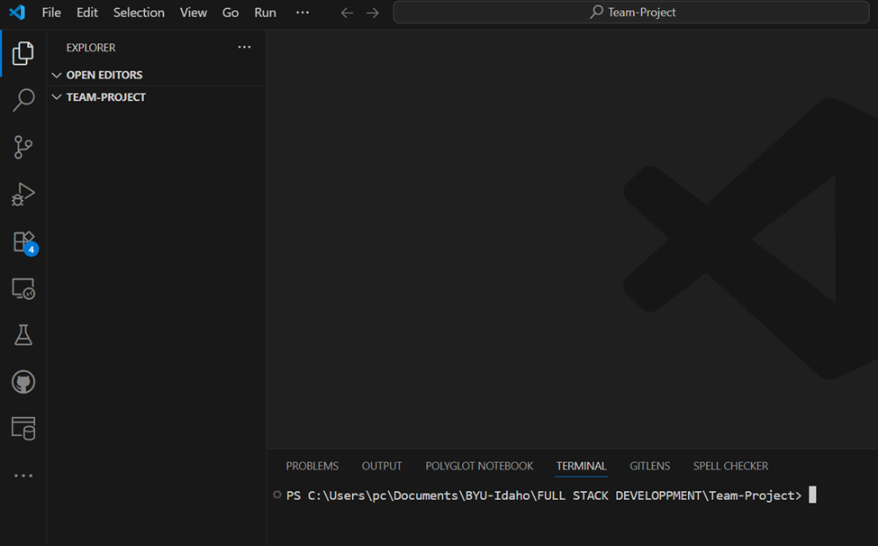

# W02 Group Project

## Project Overview
This is our Week 02 Group Project for WDD430. The purpose of the project is to practice collaborative development skills, set up our environment, establish a design theme, and begin identifying user stories for our application.  

We are working together as a team to learn project setup, GitHub collaboration, and design planning.  

---

## Group Members
- Daniel Adetaba Adongo  (Group Leader this week)  
- Emmanuel Chukwunonso Okoye  
- Djimy Francillon   

---

## Repository
🔗 **GitHub Repo URL:** (https://github.com/djimy2024/Team-Project.git)

---

## Local Setup
Each group member cloned the repository locally and confirmed the project runs on their machine.  

---

## Design Theme
**Color Scheme**  
- Primary: Deep Indigo `#3F3D56`  
- Accent: Teal `#26C6DA` 
- Background: Off-white `#F9F9F9`  

**Typography**  
- Headings: *Inter*  
- Body: *Roboto*  

**Design Notes**  
- Responsive layout for both desktop and mobile.  
- Modern, clean look with rounded edges and consistent spacing.  
- Possible use of Figma for mockups.  

---

## User Stories / Work Items
Here are our initial brainstormed work items for the project:  

1. **Setup Repository** – Create GitHub repo and add collaborators.  
2. **Setup Project Board** – Create Kanban board with To Do, In Progress, Done.  
3. **Create README.md** – Add summary, group member names, and overview.  
4. **Clone Repository** – Each group member clones the project locally.  
5. **Define Project Theme** – Select color palette, typography, and layout.  
6. **Design Wireframe** – Sketch homepage and one inner page in Figma.  
7. **Setup Dev Environment** – Install Node and necessary dependencies.  
8. **Create Base Layout** – Implement header, footer, and navigation components.  
9. **Brainstorm User Stories** – Define at least 10 user stories for features.  
10. **Assign Tasks** – Divide responsibilities among group members.  
11. **Test Deployment** – Deploy starter app to hosting service (optional early step).  

---

## Next Steps
- Continue refining design and wireframes.  
- Start implementing basic components.  
- Prepare for next group meeting and select a new group leader.  
